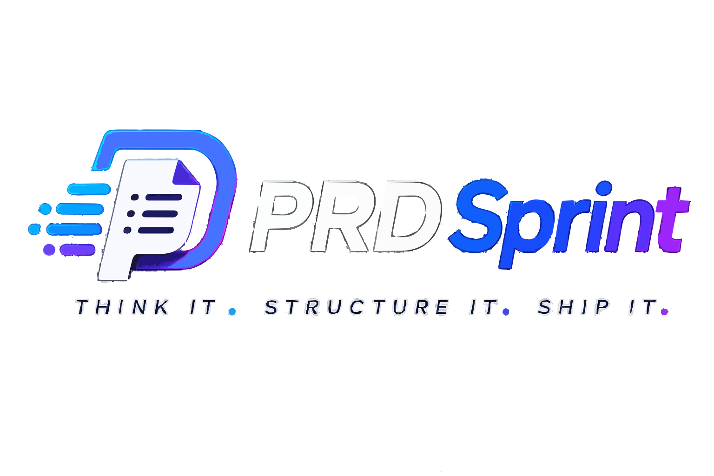
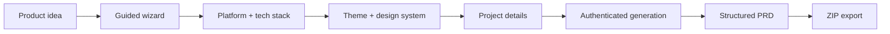
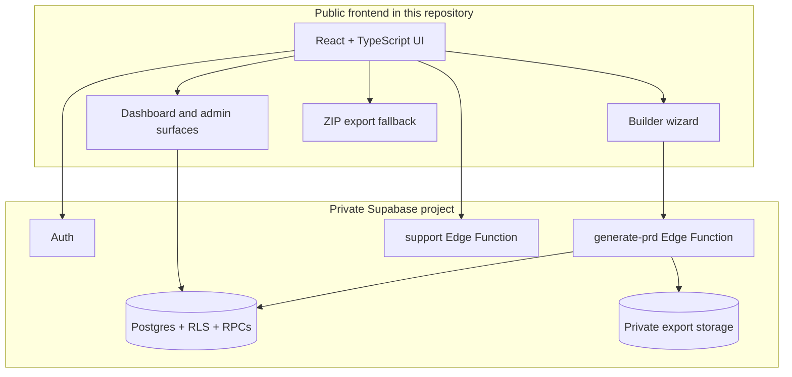

<div align="center">

  

  # PRDSprint

  **Think. Build. Launch.**

  Turn a product idea into a structured, developer-ready PRD through a guided,
  AI-assisted workflow.

  <p>
    <a href="https://github.com/yushy07/prdsprint/actions/workflows/codeql.yml"></a>
    <a href="LICENSE"></a>
    
    
    
    
  </p>

  <p>
    <a href="#getting-started">Get started</a> ·
    <a href="docs/DEPLOYMENT.md">Deploy</a> ·
    <a href="docs/ARCHITECTURE.md">Architecture</a> ·
    <a href="docs/ROADMAP.md">Roadmap</a>
  </p>

</div>

<div align="center">

  

  <br />

  <sub>From a rough idea to a clear plan for building it.</sub>

</div>

---

## What is PRDSprint?

PRDSprint is a React single-page application for creating Product Requirements
Documents. It guides a user through platform, technology, design, theme,
typography, and project-definition choices, then requests a structured PRD from
the private Supabase backend.

The public repository contains the frontend. The private backend contains the
database schema, RLS policies, RPC functions, AI provider pipeline, and Edge
Functions. This boundary keeps server-side secrets out of the browser bundle.

## Product flow



## Highlights

| Capability | What it does |
| --- | --- |
| Guided builder | Collects product, platform, stack, design, and content decisions. |
| Website and Android flows | Uses platform-specific style guides and PRD data. |
| Authenticated generation | Requires a Supabase session before generation. |
| Credit-aware workflow | Shows plans and balances while the backend remains authoritative. |
| Partial-result handling | Surfaces completed and failed sections with refund information. |
| ZIP export | Downloads generated sections as a portable Markdown package. |
| Dashboard | Displays plan, credits, and transaction history. |
| Admin surfaces | Provides operational views for users, generations, credits, and health. |
| Support workflow | Validates and routes authenticated support requests. |

## Architecture



See [Architecture](docs/ARCHITECTURE.md) for the frontend/backend boundary and
[API notes](docs/API.md) for the client integration surface.

## Tech stack

- **UI:** React 19, TypeScript 5.8, Vite 6, Tailwind CSS v4
- **Routing:** React Router 7
- **Data and auth:** Supabase JS, TanStack Query
- **Motion and effects:** Motion, Lenis, OGL, Three.js, Postprocessing
- **Charts and export:** Recharts, JSZip
- **Testing:** Vitest, Testing Library
- **Quality:** GitHub CodeQL Advanced, Dependabot, secret protection

## Getting started

### Requirements

- Node.js 22+
- npm
- A Supabase project with the frontend-facing Auth and Edge Function APIs
  configured

### Install and run

```bash
npm install
cp .env.example .env.local
npm run dev
```

The development server runs at `http://localhost:3000`.

Set only these browser-safe variables in `.env.local`:

```text
VITE_SUPABASE_URL=https://your-project.supabase.co
VITE_SUPABASE_ANON_KEY=your-public-anon-or-publishable-key
```

Never put service-role keys, AI provider keys, payment secrets, or Edge
Function secrets in frontend environment variables.

## Commands

| Command | Purpose |
| --- | --- |
| `npm run dev` | Start the Vite development server. |
| `npm run lint` | Type-check the frontend with TypeScript. |
| `npm run test` | Run the Vitest suite. |
| `npm run build` | Create the production bundle in `dist/`. |
| `npm run preview` | Preview the production bundle locally. |
| `npm run clean` | Remove local build output. |
| `npm run backup:db` | Create a manual Supabase database export. |

## Vercel deployment

This repository is configured as a frontend-only Vite deployment.

- **Framework preset:** Vite
- **Root directory:** repository root
- **Build command:** `npm run build`
- **Output directory:** `dist`

Add `VITE_SUPABASE_URL` and `VITE_SUPABASE_ANON_KEY` to Vercel Preview and
Production environments. After the first deployment, add the Vercel origin to
Supabase Auth URL Configuration for Google OAuth redirects.

Read the complete [deployment guide](docs/DEPLOYMENT.md).

## Repository structure

```text
prdsprint/
├── .github/       GitHub workflows and contribution templates
├── assets/        Repository artwork
├── docs/          Architecture, deployment, security, and operations docs
├── public/        Browser-served assets, including the product logo
├── src/           React application source
├── scripts/       Cross-platform cleanup and manual backup helpers
├── .env.example   Safe environment-variable template
└── package.json   Scripts and dependencies
```

The `supabase/` directory is intentionally ignored because the deployed
backend is private and must not be published with the frontend repository.

## Security and operations

- Keep browser-safe values limited to the `VITE_` variables.
- Keep provider and service-role secrets in Supabase Edge Function secrets.
- Review RLS and RPC authorization before production changes.
- Use `npm run backup:db` before schema changes on the Free plan.
- Review [Security](docs/SECURITY.md), [Operations](docs/OPERATIONS.md), and
  [Troubleshooting](docs/TROUBLESHOOTING.md).

## Project status

The frontend is an active MVP with the generation, credit, dashboard, admin,
support, and export surfaces implemented. The admin console now uses
server-side pagination, normalized overview metrics, stuck-generation
detection, audit/ledger CSV export, and settings history with restore support.
Payment gateway integration is intentionally deferred until the core product
is stable. Before public launch, complete the browser smoke test and confirm
the Vercel build in the deployment environment.

## Contributing

Read [CONTRIBUTING.md](docs/CONTRIBUTING.md), open an issue, or submit a pull
request. Keep changes focused, avoid committing secrets, and run the available
checks before proposing a change.

## License

PRDSprint is released under the [Apache License 2.0](LICENSE).
